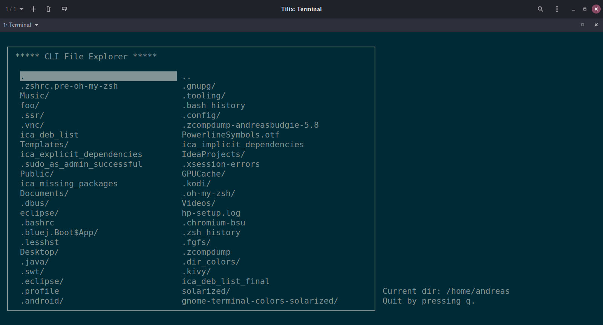

# CLIEx
A simple terminal-based file explorer written in C++ using the `ncurses` lib.

## Compile & Run

If you don't have `ncurses` installed, please do it. The following command works on Ubuntu/Debian:

`sudo apt-get install libncurses5-dev libncursesw5-dev`

For other distributions, please compile it yourself (get it from [here](https://invisible-island.net/ncurses/)).

Compile/Install with:

`make`
`sudo make install` 

---

**<u>Note:</u>**  `sudo make install` will copy `default.cfg` from the root of this repository to `/etc/cliex/`. If you don't want to install the whole program, copy that file to `~/.config/cliex/` and rename it to `user.cfg`. After that you can run `cliex` from any folder on your system.	

---

And run:

`./cliex`

## Usage

### Command line arguments

You can parse arguments at startup using this format: `--<KEY>=<VALUE>`.

| key           | possible values | description                                                  |
| ------------- | --------------- | ------------------------------------------------------------ |
| `show_hidden` | `true`, `false` | Like in `nautilus`, you can show/hide hidden files.          |
| `max_columns` | > 0             | Set the max number of columns. If it's bigger than the maximum amount of columns in the menu, it gets set to the maximum. |
|               |                 |                                                              |

Use the arrow keys to navigate between the items. You can enter directories with *ENTER*. Go back with *DELETE* . Quit with *q*.

## Screenshots

## Resources

* [ncurses](https://invisible-island.net/ncurses/)
* [astyle](http://astyle.sourceforge.net/)

## Bug reporting

If you find a bug, please let me know about that. Simply take a look at the issues pages, create an issue and I will try to fix it.

## License

GPL

